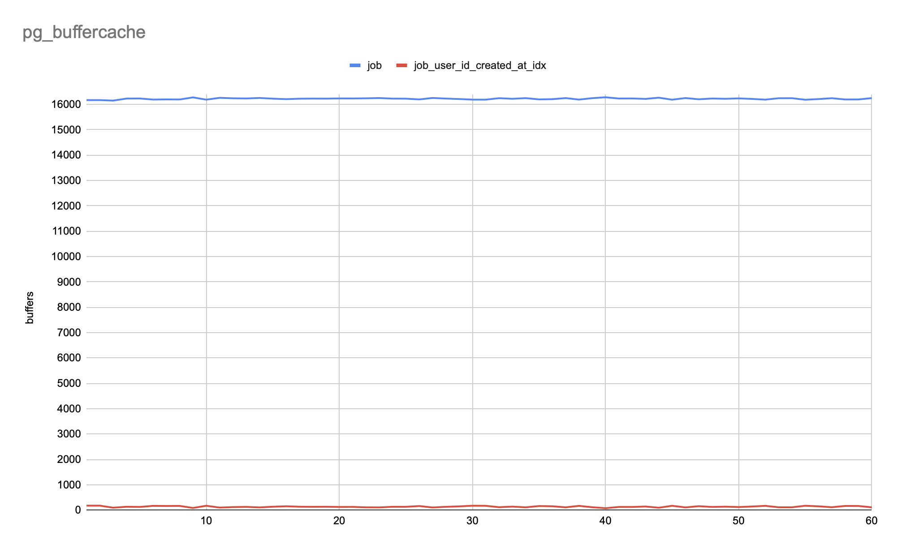
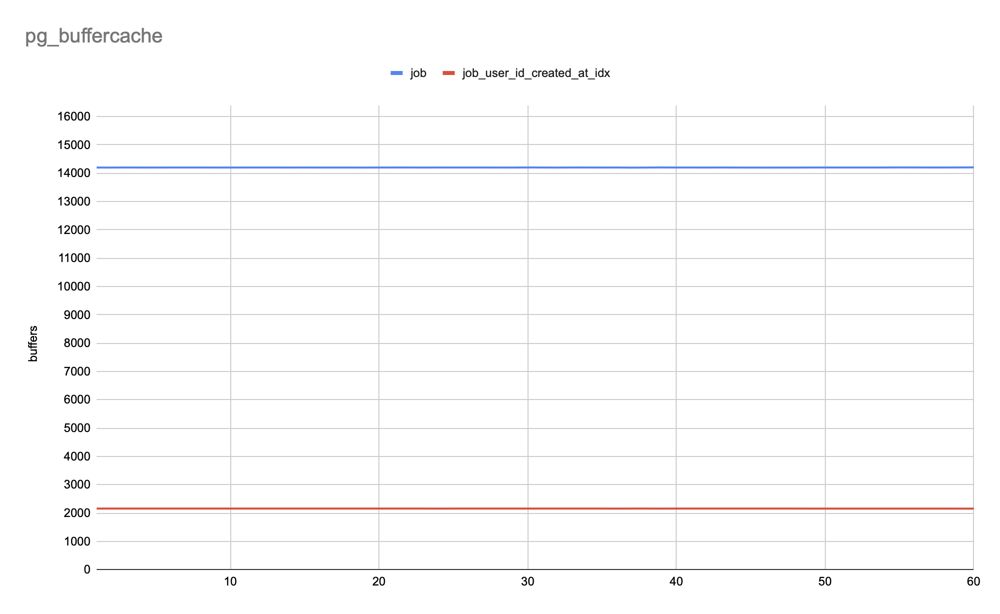

# Postgres

Table of content:

- [Explain](#explain)
- [Selectivity](#selectivity)
- [Benchmark](#benchmark)
- [Partitioning](#partitioning)
- [Statistics](#statistics)

References:

- [Explaining the unexplainable](https://www.depesz.com/tag/unexplainable/) by Hubert Lubaczewski
- [Using explain](https://www.postgresql.org/docs/current/using-explain.html)
- [Why is my index not being used?](https://www.depesz.com/2010/09/09/why-is-my-index-not-being-used/) by Hubert Lubaczewski
- [pg_stats](https://www.postgresql.org/docs/current/view-pg-stats.html)
- [pgbench](https://www.postgresql.org/docs/current/pgbench.html)
- [pg_buffercache](https://www.postgresql.org/docs/current/pgbuffercache.html)
- [Partitioning](https://www.postgresql.org/docs/current/ddl-partitioning.html)
- [Statistics collector](https://www.postgresql.org/docs/current/monitoring-stats.html)
- [pg_stat_statements](https://www.postgresql.org/docs/current/pgstatstatements.html)

There are 100K users and ~20M jobs processed (failed/successful) within 180 days.
A user on average has 100 jobs, but first ten users have 1M jobs each.
There are also 1K pending jobs created for first 1K users.

Postgres 13 runs in Virtualbox (Ubuntu with 2 CPUs, 1 GB of RAM, 40 GB disk).
Job table size is ~2.7 GB.

<details>

```sql
create table "user" (
    id bigserial primary key
);
insert into "user"
    select * from generate_series(1, 1e5);

create table job (
    id bigserial primary key,
    user_id bigint not null,
    status text,
    created_at timestamptz not null default current_timestamp,
    processed_at timestamptz
);
-- Create ~10M jobs for randomly chosen users (1% sample on each iteration).
do $$ begin
    for i in 1..1e4 loop
        insert into job (user_id, status, created_at)
            select
                id,
                case when id%1000=0 then 'failed' else 'successful' end,
                now()-random()*interval '180 days'
            from "user" tablesample system (1);
    end loop;
end $$;
-- Create ~10M jobs for first ten users.
do $$ begin
    for i in 1..10 loop
        insert into job (user_id, status, created_at)
            select
                i,
                case when s.id%1000=0 then 'failed' else 'successful' end,
                now()-random()*interval '180 days'
            from generate_series(1, 1e6) as s(id);
    end loop;
end $$;
-- Set processing time for each job.
update job set processed_at=created_at+random()*interval '15 minutes';
-- Create a pending job for first 1K users.
insert into job (user_id, status, created_at)
    select s.id, 'pending', now() from generate_series(1, 1e3) as s(id);

select pg_size_pretty(pg_relation_size('user'));
 pg_size_pretty
----------------
 3544 kB

select pg_size_pretty(pg_relation_size('job'));
 pg_size_pretty
----------------
 2755 MB
```

</details>

## Explain

Each user requests a list of recent jobs (7 days) in reverse-chronological order.

<details>

```sql
-- Force postgres to collect statistics on job table;
analyze job;

explain (analyze, buffers) select * from job
where user_id=1 and created_at>=now()-interval '7 days'
order by created_at desc;

QUERY PLAN
----------
 Gather Merge  (cost=522370.47..526147.00 rows=32368 width=42) (actual time=9259.991..9276.768 rows=38945 loops=1)
   Workers Planned: 2
   Workers Launched: 2
   Buffers: shared hit=10989 read=341676
   ->  Sort  (cost=521370.45..521410.91 rows=16184 width=42) (actual time=9256.625..9257.689 rows=12982 loops=3)
         Sort Key: created_at DESC
         Sort Method: quicksort  Memory: 1222kB
         Buffers: shared hit=10989 read=341676
         Worker 0:  Sort Method: quicksort  Memory: 2149kB
         Worker 1:  Sort Method: quicksort  Memory: 1209kB
         ->  Parallel Seq Scan on job  (cost=0.00..520239.00 rows=16184 width=42) (actual time=6564.894..9253.847 rows=12982 loops=3)
               Filter: ((user_id = 1) AND (created_at >= (now() - '7 days'::interval)))
               Rows Removed by Filter: 6635176
               Buffers: shared hit=10915 read=341676
 Planning:
   Buffers: shared hit=30
 Planning Time: 0.154 ms
 Execution Time: 9277.892 ms
```

</details>

Explain is a tree.
Upper node needs data from nodes below.

The first line (node) and `->` lines are operations (Gather Merge, Sort, Parallel Seq Scan).
Postgres executes the top one (Gather Merge)
which in turn executes the ones directly below (Sort) and gets data from them.
Parallel Seq Scan returns data to Sort.

Since [Gather Merge](https://www.postgresql.org/docs/current/how-parallel-query-works.html)
is at the very top of the plan tree, the entire query executes in parallel.
Two background workers (processes) execute the parallel portion of the plan (Sort, Parallel Seq Scan).
The leader process (backend) reads all of the tuples generated by the workers.

```sql
Gather Merge  (cost=522370.47..526147.00 rows=32368 width=42)
  ->  Sort  (cost=521370.45..521410.91 rows=16184 width=42)
    ->  Parallel Seq Scan on job  (cost=0.00..520239.00 rows=16184 width=42)
```

The costs are measured in arbitrary units determined by the planner's cost parameters.
Traditional practice is to measure the costs in units of disk page fetches `seq_page_cost=1`
and the other cost parameters are set relative to that, e.g., `random_page_cost=4`.
The cost of an upper-level operation includes the cost of all its child operations.

Explain shows start-up `cost=0.00` for starting Parallel Seq Scan operation (zero cost, just read a page and return rows),
and total `cost=520239.00` for getting alls rows returned by this operation.

Sort operation's start-up `cost=521370.45` because it has to read all rows returned by Parallel Seq Scan
and sort them before the output phase can begin.

Gather Merge's start-up `cost=522370.47` indicates that it has to wait for Sort to finish
before it can return first rows.
I think the total `cost=526147.00` is somewhat similar in effort (time, resources) to
sequentially fetching 526,147 pages (seq_page_cost * 8 KB = ~4.2 GB).

Sort's `rows=16184` is an estimated number of rows that this operation is capable of returning
(it returns rows from Parallel Seq Scan).
Gather Merge estimated 16,184 * 2 = 32,368 rows since there are 2 workers returning 16,184 rows.

`width=42` is an estimated average width (bytes) of a row returned from this operation.
Gather Merge estimated 32368 rows * 42 bytes = 1359456 bytes (~1.29 MB).

```sql
Gather Merge  (actual time=9259.991..9276.768 rows=38945 loops=1)
  ->  Sort  (actual time=9256.625..9257.689 rows=12982 loops=3)
    ->  Parallel Seq Scan on job  (actual time=6564.894..9253.847 rows=12982 loops=3)
```

The actual execution time in milliseconds is displayed when _ANALYZE_ is on.

It took Parallel Seq Scan `time=6564.894` milliseconds (6.5 seconds) to return first row to Sort operation.
Afterwards Parallel Seq Scan continued to return `rows=12982` and finished at `time=9253.847` milliseconds (9.2 seconds).

`loops=3` means the operation ran three times returning on average 12,982 rows
and it took on average 9253.847 ms to finish.
Total time spent in this operation would have been 3 loops * 9253.847 ms = 27761.5 ms,
but the operation ran in parallel (two background workers and perhaps the leader, not sure).
The query execution time was 9277.892 ms.

`Rows Removed by Filter: 6635176` means that Parallel Seq Scan filtered out 6,635,176 rows.

`Buffers: shared hit=10989 read=341676` shows how many buffers were used:

- `hit=10989` — 10,989 pages were found in the buffer cache
- `read=341676` — 341,676 pages were read from the disk

## Selectivity

Density is a measure (0..1) of the uniqueness (how often duplicates occur in a column).
The highest density `1` occurs when the same value is repeated in every row.

Selectivity is often used to describe a predicate:

- `1` — low selectivity (100% of rows are returned) due to high density
- `0.000001` — high selectivity (a smaller percentage of rows is returned) due to low density

A query planner usually chooses an index scan if a column has a higher selectivity (high uniqueness)
instead of scanning whole table.

Index will not be used if:

- table is too small (it's cheaper to do a Seq Scan)
- a large percentage of rows is returned (low selectivity)
- operations use functions, e.g., `created_at + '7 days'::interval < now()`.
  It should be `created_at < now() - '7 days'::interval`.
- there is a duplicate index ([how to find them](https://wiki.postgresql.org/wiki/Index_Maintenance#Duplicate_indexes))
- there is an intersecting index

The `pg_stats` view provides access to statistical data about the contents of the database.
Entries are created by analyze and subsequently used by the query planner.

| column            | description
| ---               | ---
| null_frac         | fraction of column entries that are null
| avg_width         | average width (10 bytes) of column's entries
| n_distinct        | estimated 2 distinct values (though there are 3 job statuses)
| most_common_vals  | "successful" and "failed" are the most common jobs
| most_common_freqs | "successful" jobs are the most frequent (0.99906665), "failed" are rare (0.00093333336)
| correlation       | 0.9980408 indicates strong statistical correlation between physical and logical row ordering (index scan on the column will be estimated to be cheaper than when it is near zero, due to reduction of random access to the disk)

Creating an index on status column would be ineffective/wasteful (134 MB) because 99.9% of jobs have "successful" status (low selectivity).
Though partial index for pending/failed jobs should be efficient (high selectivity) and take less space (160 kB).

<details>

```sql
select * from pg_stats where tablename='job' and attname='status' \gx
-[ RECORD 1 ]----------+---------------------------
schemaname             | public
tablename              | job
attname                | status
inherited              | f
null_frac              | 0
avg_width              | 10
n_distinct             | 2
most_common_vals       | {successful,failed}
most_common_freqs      | {0.99906665,0.00093333336}
histogram_bounds       |
correlation            | 0.9980408
most_common_elems      |
most_common_elem_freqs |
elem_count_histogram   |

create index on job (status) where status!='successful';

select pg_size_pretty(pg_relation_size('job_status_idx'));
 pg_size_pretty
----------------
 160 kB

explain analyze select * from job where status='pending' limit 10;
QUERY PLAN
----------
 Limit  (cost=0.29..8.30 rows=1 width=42) (actual time=0.019..0.021 rows=10 loops=1)
   ->  Index Scan using job_status_idx on job  (cost=0.29..8.30 rows=1 width=42) (actual time=0.018..0.019 rows=10 loops=1)
         Index Cond: (status = 'pending'::text)
 Planning Time: 0.054 ms
 Execution Time: 0.031 ms
```

</details>

## Benchmark

The following pgbench script simulates a workload where few users generate excessive load
(first ten users have 1M jobs each).

For example, `random_zipfian(1, 1e5, 1.07)` produces user ID `1` about `(2/1)**1.07 = 2.1` times more frequently than `2`.
User ID `2` is produced `(3/2)**2.1 = 2.34` times more frequently than `3`, and so on.

The benchmark that ran for 60 seconds with 10 concurrent db sessions
shows 0.74 average transaction rate (transactions per second).

<details>

```sh
$ cat > bench.sql <<SQL
\set r random_zipfian(1, 1e5, 1.07)
select * from job
where user_id=:r and created_at>=now()-interval '7 days'
order by created_at desc;
SQL

$ pgbench -U postgres --time=60 --client=10 -f bench.sql
number of clients: 10
number of threads: 1
duration: 60 s
number of transactions actually processed: 54
latency average = 13449.354 ms
tps = 0.743530 (including connections establishing)
tps = 0.743540 (excluding connections establishing)
```

</details>

Since jobs are filtered by user ID and sorted by creation date,
it makes sense to create `user_id, created_at` index to speed up the query.
It will be executed faster if all needed index pages are in the buffer cache
(array of buffers located in shared memory of Postgres processes).

A backend process (connection) checks the buffer cache.
If a page wasn't there, then Postgres asks OS to read a certain page into the buffer cache.
OS first looks up that page in its cache, and then checks disk if there was a cache miss:
OS reads from disk, then writes data into OS cache, then Postgres puts data into buffer cache.

When buffer cache becomes full:

- Postgres evicts least recently used page
- if the page was modified, it's considered dirty and must be written on disk
- changes are sequentially written into WAL on each transaction commit with fsync

There are only 16,384 buffers (128 MB), so the buffer cache quickly fills up (600 MB index and ~2.7 GB job table).
`pg_buffercache` view shows what's happening in the shared buffer cache in real time.

<details>

```sql
-- There are 16,384 buffers (128 MB).
select count(*) from pg_buffercache;
 count
-------
 16384

create index on job (user_id, created_at);

select pg_size_pretty(pg_relation_size('job_user_id_created_at_idx'));
 pg_size_pretty
----------------
 600 MB

-- Every second show two relations that take most of the buffers.
do $$
declare
    r record;
begin
    for i in 1..60 loop
        for r in (select c.relname, count(*) as buffers
            from pg_buffercache b
            join pg_class c on b.relfilenode = pg_relation_filenode(c.oid)
            group by c.relname
            order by buffers desc limit 2)
        loop
            raise info '%', r;
        end loop;

        perform pg_sleep(1);
        raise info '';
    end loop;
end $$;

INFO:  (job,16172)
INFO:  (job_user_id_created_at_idx,180)
INFO:
INFO:  (job,16172)
INFO:  (job_user_id_created_at_idx,180)
INFO:
INFO:  (job,16153)
INFO:  (job_user_id_created_at_idx,99)
INFO:
INFO:  (job,16233)
INFO:  (job_user_id_created_at_idx,136)
INFO:
INFO:  (job,16236)
INFO:  (job_user_id_created_at_idx,129)
INFO:
INFO:  (job,16194)
INFO:  (job_user_id_created_at_idx,172)
INFO:
INFO:  (job,16200)
INFO:  (job_user_id_created_at_idx,167)
INFO:
INFO:  (job,16197)
INFO:  (job_user_id_created_at_idx,170)
INFO:
INFO:  (job,16279)
INFO:  (job_user_id_created_at_idx,89)
INFO:
INFO:  (job,16190)
INFO:  (job_user_id_created_at_idx,176)
INFO:
INFO:  (job,16262)
INFO:  (job_user_id_created_at_idx,104)
INFO:
INFO:  (job,16244)
INFO:  (job_user_id_created_at_idx,123)
INFO:
INFO:  (job,16237)
INFO:  (job_user_id_created_at_idx,131)
INFO:
INFO:  (job,16257)
INFO:  (job_user_id_created_at_idx,111)
INFO:
INFO:  (job,16229)
INFO:  (job_user_id_created_at_idx,138)
INFO:
INFO:  (job,16210)
INFO:  (job_user_id_created_at_idx,156)
INFO:
INFO:  (job,16228)
INFO:  (job_user_id_created_at_idx,138)
INFO:
INFO:  (job,16232)
INFO:  (job_user_id_created_at_idx,134)
INFO:
INFO:  (job,16230)
INFO:  (job_user_id_created_at_idx,137)
INFO:
INFO:  (job,16238)
INFO:  (job_user_id_created_at_idx,128)
INFO:
INFO:  (job,16237)
INFO:  (job_user_id_created_at_idx,130)
INFO:
INFO:  (job,16243)
INFO:  (job_user_id_created_at_idx,114)
INFO:
INFO:  (job,16254)
INFO:  (job_user_id_created_at_idx,111)
INFO:
INFO:  (job,16231)
INFO:  (job_user_id_created_at_idx,135)
INFO:
INFO:  (job,16229)
INFO:  (job_user_id_created_at_idx,135)
INFO:
INFO:  (job,16199)
INFO:  (job_user_id_created_at_idx,165)
INFO:
INFO:  (job,16257)
INFO:  (job_user_id_created_at_idx,108)
INFO:
INFO:  (job,16233)
INFO:  (job_user_id_created_at_idx,134)
INFO:
INFO:  (job,16215)
INFO:  (job_user_id_created_at_idx,152)
INFO:
INFO:  (job,16191)
INFO:  (job_user_id_created_at_idx,177)
INFO:
INFO:  (job,16191)
INFO:  (job_user_id_created_at_idx,174)
INFO:
INFO:  (job,16248)
INFO:  (job_user_id_created_at_idx,119)
INFO:
INFO:  (job,16224)
INFO:  (job_user_id_created_at_idx,142)
INFO:
INFO:  (job,16250)
INFO:  (job_user_id_created_at_idx,114)
INFO:
INFO:  (job,16200)
INFO:  (job_user_id_created_at_idx,165)
INFO:
INFO:  (job,16209)
INFO:  (job_user_id_created_at_idx,156)
INFO:
INFO:  (job,16252)
INFO:  (job_user_id_created_at_idx,114)
INFO:
INFO:  (job,16193)
INFO:  (job_user_id_created_at_idx,172)
INFO:
INFO:  (job,16249)
INFO:  (job_user_id_created_at_idx,117)
INFO:
INFO:  (job,16284)
INFO:  (job_user_id_created_at_idx,80)
INFO:
INFO:  (job,16235)
INFO:  (job_user_id_created_at_idx,129)
INFO:
INFO:  (job,16237)
INFO:  (job_user_id_created_at_idx,128)
INFO:
INFO:  (job,16220)
INFO:  (job_user_id_created_at_idx,146)
INFO:
INFO:  (job,16268)
INFO:  (job_user_id_created_at_idx,98)
INFO:
INFO:  (job,16189)
INFO:  (job_user_id_created_at_idx,175)
INFO:
INFO:  (job,16253)
INFO:  (job_user_id_created_at_idx,111)
INFO:
INFO:  (job,16205)
INFO:  (job_user_id_created_at_idx,159)
INFO:
INFO:  (job,16235)
INFO:  (job_user_id_created_at_idx,129)
INFO:
INFO:  (job,16224)
INFO:  (job_user_id_created_at_idx,140)
INFO:
INFO:  (job,16240)
INFO:  (job_user_id_created_at_idx,125)
INFO:
INFO:  (job,16219)
INFO:  (job_user_id_created_at_idx,146)
INFO:
INFO:  (job,16191)
INFO:  (job_user_id_created_at_idx,173)
INFO:
INFO:  (job,16246)
INFO:  (job_user_id_created_at_idx,116)
INFO:
INFO:  (job,16248)
INFO:  (job_user_id_created_at_idx,115)
INFO:
INFO:  (job,16187)
INFO:  (job_user_id_created_at_idx,176)
INFO:
INFO:  (job,16213)
INFO:  (job_user_id_created_at_idx,154)
INFO:
INFO:  (job,16247)
INFO:  (job_user_id_created_at_idx,118)
INFO:
INFO:  (job,16197)
INFO:  (job_user_id_created_at_idx,169)
INFO:
INFO:  (job,16198)
INFO:  (job_user_id_created_at_idx,167)
INFO:
INFO:  (job,16251)
INFO:  (job_user_id_created_at_idx,114)
```

</details>

The benchmark showed 34.95 tps with average latency 286.084 ms.
Pages of job table almost fully occupy the buffers (16224 buffers on average, min 16153, max 16284).
Index pages occupy 138 buffers on average (1.07 MB), min 80, max 180.



<details>

```sql
drop index job_user_id_created_at_idx;

create index on job (created_at, user_id);

select pg_size_pretty(pg_relation_size('job_created_at_user_id_idx'));
 pg_size_pretty
----------------
 599 MB

do $$
declare
    r record;
begin
    for i in 1..60 loop
        for r in (select c.relname, count(*) as buffers
            from pg_buffercache b
            join pg_class c on b.relfilenode = pg_relation_filenode(c.oid)
            group by c.relname
            order by buffers desc limit 2)
        loop
            raise info '%', r;
        end loop;

        perform pg_sleep(1);
        raise info '';
    end loop;
end $$;

INFO:  (job,14204)
INFO:  (job_created_at_user_id_idx,2162)
INFO:
INFO:  (job,14203)
INFO:  (job_created_at_user_id_idx,2162)
INFO:
INFO:  (job,14206)
INFO:  (job_created_at_user_id_idx,2162)
INFO:
INFO:  (job,14204)
INFO:  (job_created_at_user_id_idx,2162)
INFO:
INFO:  (job,14204)
INFO:  (job_created_at_user_id_idx,2162)
INFO:
INFO:  (job,14205)
INFO:  (job_created_at_user_id_idx,2162)
INFO:
INFO:  (job,14205)
INFO:  (job_created_at_user_id_idx,2162)
INFO:
INFO:  (job,14205)
INFO:  (job_created_at_user_id_idx,2162)
INFO:
INFO:  (job,14204)
INFO:  (job_created_at_user_id_idx,2162)
INFO:
INFO:  (job,14204)
INFO:  (job_created_at_user_id_idx,2162)
INFO:
INFO:  (job,14205)
INFO:  (job_created_at_user_id_idx,2162)
INFO:
INFO:  (job,14205)
INFO:  (job_created_at_user_id_idx,2162)
INFO:
INFO:  (job,14205)
INFO:  (job_created_at_user_id_idx,2162)
INFO:
INFO:  (job,14204)
INFO:  (job_created_at_user_id_idx,2162)
INFO:
INFO:  (job,14205)
INFO:  (job_created_at_user_id_idx,2162)
INFO:
INFO:  (job,14204)
INFO:  (job_created_at_user_id_idx,2162)
INFO:
INFO:  (job,14204)
INFO:  (job_created_at_user_id_idx,2162)
INFO:
INFO:  (job,14204)
INFO:  (job_created_at_user_id_idx,2162)
INFO:
INFO:  (job,14203)
INFO:  (job_created_at_user_id_idx,2162)
INFO:
INFO:  (job,14205)
INFO:  (job_created_at_user_id_idx,2162)
INFO:
INFO:  (job,14206)
INFO:  (job_created_at_user_id_idx,2162)
INFO:
INFO:  (job,14206)
INFO:  (job_created_at_user_id_idx,2162)
INFO:
INFO:  (job,14204)
INFO:  (job_created_at_user_id_idx,2162)
INFO:
INFO:  (job,14206)
INFO:  (job_created_at_user_id_idx,2161)
INFO:
INFO:  (job,14205)
INFO:  (job_created_at_user_id_idx,2162)
INFO:
INFO:  (job,14205)
INFO:  (job_created_at_user_id_idx,2162)
INFO:
INFO:  (job,14205)
INFO:  (job_created_at_user_id_idx,2162)
INFO:
INFO:  (job,14204)
INFO:  (job_created_at_user_id_idx,2162)
INFO:
INFO:  (job,14204)
INFO:  (job_created_at_user_id_idx,2162)
INFO:
INFO:  (job,14207)
INFO:  (job_created_at_user_id_idx,2162)
INFO:
INFO:  (job,14205)
INFO:  (job_created_at_user_id_idx,2162)
INFO:
INFO:  (job,14203)
INFO:  (job_created_at_user_id_idx,2162)
INFO:
INFO:  (job,14206)
INFO:  (job_created_at_user_id_idx,2162)
INFO:
INFO:  (job,14206)
INFO:  (job_created_at_user_id_idx,2162)
INFO:
INFO:  (job,14204)
INFO:  (job_created_at_user_id_idx,2162)
INFO:
INFO:  (job,14205)
INFO:  (job_created_at_user_id_idx,2161)
INFO:
INFO:  (job,14201)
INFO:  (job_created_at_user_id_idx,2162)
INFO:
INFO:  (job,14204)
INFO:  (job_created_at_user_id_idx,2162)
INFO:
INFO:  (job,14207)
INFO:  (job_created_at_user_id_idx,2161)
INFO:
INFO:  (job,14205)
INFO:  (job_created_at_user_id_idx,2162)
INFO:
INFO:  (job,14205)
INFO:  (job_created_at_user_id_idx,2162)
INFO:
INFO:  (job,14204)
INFO:  (job_created_at_user_id_idx,2162)
INFO:
INFO:  (job,14206)
INFO:  (job_created_at_user_id_idx,2162)
INFO:
INFO:  (job,14204)
INFO:  (job_created_at_user_id_idx,2162)
INFO:
INFO:  (job,14203)
INFO:  (job_created_at_user_id_idx,2162)
INFO:
INFO:  (job,14202)
INFO:  (job_created_at_user_id_idx,2162)
INFO:
INFO:  (job,14203)
INFO:  (job_created_at_user_id_idx,2162)
INFO:
INFO:  (job,14203)
INFO:  (job_created_at_user_id_idx,2162)
INFO:
INFO:  (job,14205)
INFO:  (job_created_at_user_id_idx,2161)
INFO:
INFO:  (job,14206)
INFO:  (job_created_at_user_id_idx,2161)
INFO:
INFO:  (job,14205)
INFO:  (job_created_at_user_id_idx,2161)
INFO:
INFO:  (job,14205)
INFO:  (job_created_at_user_id_idx,2161)
INFO:
INFO:  (job,14205)
INFO:  (job_created_at_user_id_idx,2161)
INFO:
INFO:  (job,14206)
INFO:  (job_created_at_user_id_idx,2161)
INFO:
INFO:  (job,14208)
INFO:  (job_created_at_user_id_idx,2161)
INFO:
INFO:  (job,14207)
INFO:  (job_created_at_user_id_idx,2161)
INFO:
INFO:  (job,14206)
INFO:  (job_created_at_user_id_idx,2161)
INFO:
INFO:  (job,14206)
INFO:  (job_created_at_user_id_idx,2161)
INFO:
INFO:  (job,14207)
INFO:  (job_created_at_user_id_idx,2160)
INFO:
INFO:  (job,14210)
INFO:  (job_created_at_user_id_idx,2160)
```

</details>

The benchmark using `created_at, user_id` index showed similar performance — 35.34 tps with average latency 282.907 ms.
However the index takes more space and the buffer cache usage doesn't fluctuate as much:

- table pages — 14,204 buffers (min 14201, max 14210)
- index pages — 2,161 buffers (min 2160, 2162) ~ 16.8 MB

The observation suggests that Postgres finds all needed index parts (jobs created in 7 days)
in the buffer cache and doesn't need to often evict them.
This behaviour should provide consistent query performance.



## Partitioning

Dividing jobs by their creation date should provide the following benefits:

- improved query performance, e.g., frequently accessed rows (jobs created in last 7 days)
  are located in the single partition.
  Reduced index size makes it more likely that the heavily-used parts of the indexes fit in memory.
- sequential scan on a partition might have better performance
  compared to using an index and random access reads scattered across the whole table
- seldom-used data can be migrated to cheaper and slower storage media

The divided table jobp is called a partitioned table.
All rows inserted into jobp will be routed to one of the partitions based on the value of created_at.
Uniqueness is enforced in each partition individually.
Creating an index on partitioned table automatically creates one index on each partition,
and any partitions created/attached later will also contain the index.

<details>

```sql
create table jobp (
    id bigserial,
    user_id bigint not null,
    status text,
    created_at timestamptz not null default current_timestamp,
    processed_at timestamptz
) partition by range (created_at);

-- There should be 7 partitions (2020-06 .. 2020-12).
select min(created_at), max(created_at) from job;
              min              |              max
-------------------------------+-------------------------------
 2020-06-07 16:47:12.180953+00 | 2020-12-04 16:48:52.674547+00

-- June
create table job_2020_6 partition of jobp (
    primary key (id)
) for values from ('2020-06-01') to ('2020-07-01');
-- July
create table job_2020_7 partition of jobp (
    primary key (id)
) for values from ('2020-07-01') to ('2020-08-01');
-- August
create table job_2020_8 partition of jobp (
    primary key (id)
) for values from ('2020-08-01') to ('2020-09-01');
-- September
create table job_2020_9 partition of jobp (
    primary key (id)
) for values from ('2020-09-01') to ('2020-10-01');
-- October
create table job_2020_10 partition of jobp (
    primary key (id)
) for values from ('2020-10-01') to ('2020-11-01');
-- November
create table job_2020_11 partition of jobp (
    primary key (id)
) for values from ('2020-11-01') to ('2020-12-01');
-- December
create table job_2020_12 partition of jobp (
    primary key (id)
) for values from ('2020-12-01') to ('2021-01-01');

insert into jobp select * from job;
```

</details>

The benchmark using `created_at, user_id` index showed 48.55 tps (previously 35.34 tps) with average latency 205.965 ms (previously 286.084 ms).
Index on `user_id, created_at` yielded 180.38 tps with average latency 55.436 ms.

Too many partitions can mean longer query planning times and higher memory consumption during both query planning and execution.
For example, pending job lookup: 0.253 ms planning (previously 0.054 ms), 0.046 ms execution (previously 0.031 ms).

<details>

```sql
create index on jobp (status) where status!='successful';

explain analyze select * from jobp where status='pending' limit 10;
QUERY PLAN
----------
 Limit  (cost=0.28..2.18 rows=10 width=42) (actual time=0.026..0.028 rows=10 loops=1)
   ->  Append  (cost=0.28..176.26 rows=926 width=42) (actual time=0.025..0.027 rows=10 loops=1)
         ->  Index Scan using job_2020_6_status_idx on job_2020_6 jobp_1  (cost=0.28..4.32 rows=1 width=42) (actual time=0.009..0.009 rows=0 loops=1)
               Index Cond: (status = 'pending'::text)
         ->  Index Scan using job_2020_7_status_idx on job_2020_7 jobp_2  (cost=0.28..8.30 rows=1 width=42) (actual time=0.002..0.002 rows=0 loops=1)
               Index Cond: (status = 'pending'::text)
         ->  Index Scan using job_2020_8_status_idx on job_2020_8 jobp_3  (cost=0.28..4.31 rows=1 width=42) (actual time=0.003..0.003 rows=0 loops=1)
               Index Cond: (status = 'pending'::text)
         ->  Index Scan using job_2020_9_status_idx on job_2020_9 jobp_4  (cost=0.28..4.31 rows=1 width=42) (actual time=0.002..0.002 rows=0 loops=1)
               Index Cond: (status = 'pending'::text)
         ->  Index Scan using job_2020_10_status_idx on job_2020_10 jobp_5  (cost=0.28..4.32 rows=1 width=42) (actual time=0.002..0.002 rows=0 loops=1)
               Index Cond: (status = 'pending'::text)
         ->  Index Scan using job_2020_11_status_idx on job_2020_11 jobp_6  (cost=0.28..4.31 rows=1 width=42) (actual time=0.002..0.002 rows=0 loops=1)
               Index Cond: (status = 'pending'::text)
         ->  Index Scan using job_2020_12_status_idx on job_2020_12 jobp_7  (cost=0.28..141.77 rows=920 width=42) (actual time=0.006..0.007 rows=10 loops=1)
               Index Cond: (status = 'pending'::text)
 Planning Time: 0.253 ms
 Execution Time: 0.046 ms
```

</details>

## Statistics

Statistics collector counts accesses to tables and indexes in disk-block and individual-row terms.
It also tracks the total number of rows in each table, and information about vacuum and analyze actions for each table.

Each process transmits new statistical counts to the collector just before going idle;
so a query or transaction still in progress does not affect the displayed totals.
The collector aggregates counts in memory and every 500 ms writes a report to disk.
When a process needs to access a report, it first fetches the most recent one from disk and
then continues to use this snapshot for all statistical views until the end of its current transaction.

The per-index statistics are particularly useful to determine which indexes are being used (`idx_scan` should be positive)
and how effective they are.
The `pg_stat_all_indexes` view contains one row for each index, showing statistics about accesses to that specific index.

| column        | description
| ---           | ---
| idx_scan      | 2,486 index scans initiated on this index
| idx_tup_read  | 23,136,290 index tuples returned by scans on this index
| idx_tup_fetch | 5,383 live tuples fetched by simple index scans using this index

<details>

```sql
select * from pg_stat_all_indexes where relid='job'::regclass and indexrelname='job_created_at_user_id_idx' \gx
-[ RECORD 1 ]-+---------------------------
relid         | 32858
indexrelid    | 32877
schemaname    | public
relname       | job
indexrelname  | job_created_at_user_id_idx
idx_scan      | 2486
idx_tup_read  | 23136290
idx_tup_fetch | 5383
```

</details>

The `pg_statio_` views are primarily useful to determine the effectiveness of the buffer cache.
When the number of actual disk reads is much smaller than the number of buffer hits,
then the cache is satisfying most read requests without invoking a kernel call.
Note, evicted buffers might still reside in the kernel's I/O cache and still be fetched without requiring a disk read.
The `pg_statio_all_tables` view contains one row for each table (including TOAST tables),
showing statistics about I/O on that specific table (how many pages were read/written):

| column         | description
| ---            | ---
| heap_blks_read | 72,929,355 table pages read from disk
| heap_blks_hit  | 205,749,371 table pages read from the buffer cache
| idx_blks_read  | 482,699 index pages read from disk (in all indexes on this table)
| idx_blks_hit   | 85,594,519 index pages read from the buffer cache (in all indexes on this table)

~85.5M index pages were read from the buffer cache, and ~0.5M from disk.

<details>

```sql
select * from pg_statio_all_tables where relid='job'::regclass \gx
-[ RECORD 1 ]---+----------
relid           | 32858
schemaname      | public
relname         | job
heap_blks_read  | 72929355
heap_blks_hit   | 205749371
idx_blks_read   | 482699
idx_blks_hit    | 85594519
toast_blks_read | 0
toast_blks_hit  | 0
tidx_blks_read  | 0
tidx_blks_hit   | 0
```

```python
idx_blks_read = 482699.
idx_blks_hit = 85594519.
idx_blks_total = idx_blks_read + idx_blks_hit
hit_percent = idx_blks_hit * 100 / idx_blks_total
read_percent = 100 - hit_percent
print('{hit:.2f}% index pages were read from the buffer cache, and {read:.2f}% from disk.'.format(hit=hit_percent, read=read_percent))
# 99.44% index pages were read from the buffer cache, and 0.56% from disk.
```

</details>

Row versions (tuples) accumulate and require clean up to prevent query perf loss (scans through dead tuples).
If a table is frequently updated but not vacuumed often,
the segment files grow in size and don't shrink,
because vacuum doesn't change their structure (it only marks unused tuple space as usable again).
The `pg_stat_all_tables` view contains one row for each table (including TOAST tables),
showing statistics about accesses to that specific table (how many tuples were added/updated/deleted/read).

| column              | description
| ---                 | ---
| seq_scan            | 163 sequential scans initiated on this table
| idx_scan            | 2,489 index scans initiated on this table
| n_tup_ins           | 19,944,472 tuples inserted
| n_tup_upd           | 19,943,472 tuples updated (includes HOT updated rows)
| n_tup_hot_upd       | 0 rows HOT updated (i.e., with no separate index update required)
| n_tup_del           | 0 tuples deleted
| n_live_tup          | estimated 19,831,034 live tuples
| n_dead_tup          | estimated 0 dead tuples
| n_mod_since_analyze | estimated 0 rows modified since this table was last analyzed
| n_ins_since_vacuum  | estimated 0 rows inserted since this table was last vacuumed
| last_vacuum         | last time at which this table was manually vacuumed (not counting `vacuum full`), i.e., `vacuum job`
| vacuum_count        | this table has been manually vacuumed 0 times
| last_autovacuum     | last time at which this table was vacuumed by the autovacuum process
| autovacuum_count    | this table has been vacuumed 2 times by the autovacuum process
| last_analyze        | last time at which this table was manually analyzed, i.e., `analyze job` updated data distribution stats
| analyze_count       | this table has been manually analyzed 7 times
| last_autoanalyze    | last time at which this table was analyzed by the autovacuum process
| autoanalyze_count   | this table has been analyzed 1 time by the autovacuum process

<details>

```sql
select * from pg_stat_all_tables where relid='job'::regclass \gx
-[ RECORD 1 ]-------+------------------------------
relid               | 32858
schemaname          | public
relname             | job
seq_scan            | 163
seq_tup_read        | 1595556760
idx_scan            | 2489
idx_tup_fetch       | 96339909
n_tup_ins           | 19944472
n_tup_upd           | 19943472
n_tup_del           | 0
n_tup_hot_upd       | 0
n_live_tup          | 19831034
n_dead_tup          | 0
n_mod_since_analyze | 0
n_ins_since_vacuum  | 0
last_vacuum         |
last_autovacuum     | 2020-11-19 18:46:26.130802+00
last_analyze        | 2020-11-21 19:03:28.003276+00
last_autoanalyze    | 2020-11-19 18:40:02.880983+00
vacuum_count        | 0
autovacuum_count    | 2
analyze_count       | 7
autoanalyze_count   | 1

-- See how many dead tuples accumulated, when the tables were vacuumed
-- and analyzed (optimizer should have fresh stats) by the autovacuum process.
select relname, n_dead_tup, (now()-last_autovacuum) as last_autovacuum, (now()-last_autoanalyze) as last_autoanalyze
from pg_stat_all_tables
order by n_dead_tup desc;
```

</details>

Write ahead log (WAL) is a stream of executed actions (16 MB segment files).
Checkpointer process periodically writes all dirty pages on disk.
This helps to keep the WAL size fairly small — old WAL segments can be deleted after a checkpoint.
Checkpointer also writes recovery information into the control file (longer it takes to write, longer the recovery will be).
Bgwriter (background writer) process writes dirty pages that will likely be evicted soon.
Backend also writes dirty pages on disk if there are not enough buffers for a query.
The `pg_stat_bgwriter` view shows who wrote dirty pages on disk.

| column                | description
| ---                   | ---
| checkpoints_timed     | checkpointer was scheduled 937 times, i.e., every `checkpoint_timeout=5m` (should be ~15-30 minutes to reduce resources usage)
| checkpoints_req       | checkpointer had to run 132 times outside of its schedule because WAL exceeded `max_wal_size=1GB` (rush hour)
| checkpoint_write_time | total amount of time spent (1,741,333 ms) in the portion of checkpoint processing where files are written to disk
| checkpoint_sync_time  | total amount of time spent (3,033 ms) in the portion of checkpoint processing where files are fsynced
| buffers_checkpoint    | checkpointer wrote 343,244 pages on disk
| buffers_clean         | bgwriter wrote 586,467 pages on disk
| buffers_backend       | backends wrote 9,947,797 pages on disk
| maxwritten_clean      | bgwriter stopped a cleaning scan 5,247 times because it had written too many buffers
| buffers_backend_fsync | number of times a backend had to execute its own fsync call (normally the bgwriter handles those even when the backend does its own write)

<details>

```sql
-- Call checkpoint to write dirty pages on disk.
checkpoint;

select * from pg_stat_bgwriter \gx
-[ RECORD 1 ]---------+------------------------------
checkpoints_timed     | 937
checkpoints_req       | 132
checkpoint_write_time | 1741333
checkpoint_sync_time  | 3033
buffers_checkpoint    | 343244
buffers_clean         | 586467
maxwritten_clean      | 5247
buffers_backend       | 9947797
buffers_backend_fsync | 0
buffers_alloc         | 62375448
stats_reset           | 2020-11-10 19:37:48.698163+00
```

</details>

The `pg_stat_database` view contains one row for each database in the cluster, plus one for shared objects,
showing database-wide statistics.

| column         | description
| ---            | ---
| numbackends    | 1 backend is currently connected to this database
| xact_commit    | 3,042,909 committed transactions
| xact_rollback  | 171 transactions rolled back
| blks_read      | 90,880,125 pages read from disk
| blks_hit       | 1,419,538,822 pages read from the buffer cache
| tup_returned   | 3,129,145,899 tuples returned by queries
| tup_fetched    | 236,406,974 tuples fetched by queries
| tup_inserted   | 330,560,604 tuples inserted by queries
| tup_updated    | 19,943,622 tuples updated by queries
| tup_deleted    | 536 tuples deleted by queries
| conflicts      | 0 queries canceled due to conflicts with recovery
| deadlocks      | 0 deadlocks detected
| blk_read_time  | 3,401.737 ms spent reading data file blocks by backends
| blk_write_time | 0.063 ms spent writing data file blocks by backends

<details>

```sql
-- Enables timing of database I/O calls.
-- I/O timing is displayed in pg_stat_database, pg_stat_statements, EXPLAIN (BUFFERS).
alter system set track_io_timing=on;
select pg_reload_conf();

select * from pg_stat_database where datname='postgres' \gx
-[ RECORD 1 ]---------+------------------------------
datid                 | 12662
datname               | postgres
numbackends           | 1
xact_commit           | 3042909
xact_rollback         | 171
blks_read             | 90880125
blks_hit              | 1419538822
tup_returned          | 3129145899
tup_fetched           | 236406974
tup_inserted          | 330560604
tup_updated           | 19943622
tup_deleted           | 536
conflicts             | 0
temp_files            | 100
temp_bytes            | 26318205668
deadlocks             | 0
checksum_failures     | 0
checksum_last_failure |
blk_read_time         | 3401.737
blk_write_time        | 0.063
stats_reset           | 2020-11-10 19:44:15.749057+00
```

</details>

The `pg_stat_statements` module tracks query planning/execution statistics.

| column              | description
| ---                 | ---
| calls               | the query was executed 3,448 times
| total_exec_time     | total time spent executing the query is 605,850 ms
| min_exec_time       | the query took minimum 5.72 ms
| max_exec_time       | the query took maximum 2,861.67 ms
| mean_exec_time      | the query took 175.71 ms on average (total_exec_time / calls)
| rows                | 19,424,242 rows (total number) retrieved or affected by executing the query 3,448 times
| shared_blks_hit     | 8,243,230 index/table pages read (total number) from the buffer cache (61.33%)
| shared_blks_read    | 5,197,533 index/table pages read (total number) from disk
| shared_blks_dirtied | 0 buffers dirtied because of the query
| shared_blks_written | 1 buffer was written
| blk_read_time       | the query spent 233,343.9 ms (total time) reading blocks
| blk_write_time      | the query spent 0.083852 ms (total time) writing blocks
| non-disk (cpu)      | the query spent 372,506 ms (total time) using CPU (total_exec_time - blk_read_time - blk_write_time)

<details>

```sql
select *, 100.0 * shared_blks_hit / nullif(shared_blks_hit + shared_blks_read, 0) as hit_percent
from pg_stat_statements
order by total_exec_time desc limit 1 \gx
-[ RECORD 1 ]-------+---------------------------------------------------
userid              | 10
dbid                | 12662
queryid             | -3996610330858309613
query               | select * from job                                 +
                    | where user_id=$1 and created_at>=now()-interval $2+
                    | order by created_at desc
plans               | 0
total_plan_time     | 0
min_plan_time       | 0
max_plan_time       | 0
mean_plan_time      | 0
stddev_plan_time    | 0
calls               | 3448
total_exec_time     | 605850.2305030001
min_exec_time       | 5.721114999999999
max_exec_time       | 2861.678023
mean_exec_time      | 175.71062369576526
stddev_exec_time    | 473.22153332402075
rows                | 19424242
shared_blks_hit     | 8243230
shared_blks_read    | 5197533
shared_blks_dirtied | 0
shared_blks_written | 1
local_blks_hit      | 0
local_blks_read     | 0
local_blks_dirtied  | 0
local_blks_written  | 0
temp_blks_read      | 0
temp_blks_written   | 0
blk_read_time       | 233343.90670400002
blk_write_time      | 0.083852
wal_records         | 0
wal_fpi             | 0
wal_bytes           | 0
hit_percent         | 61.3300747881649278
```

</details>
