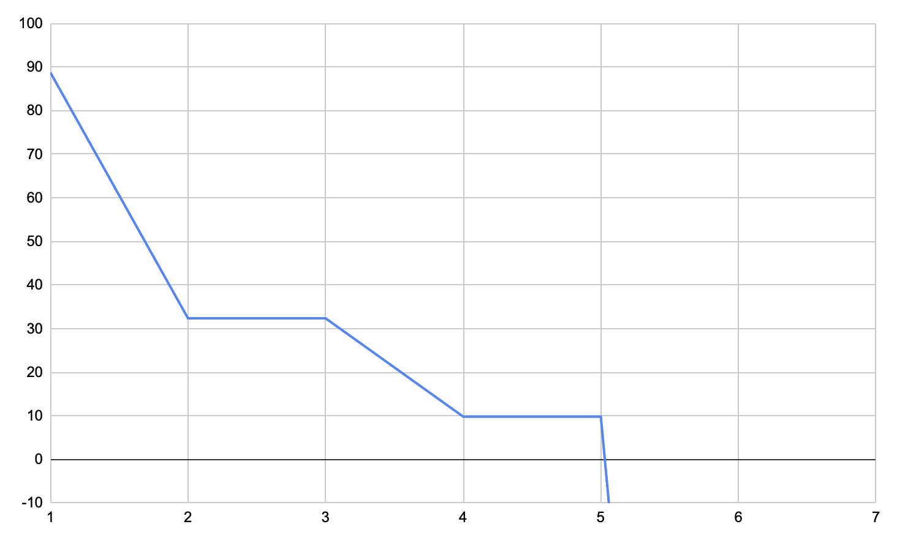

# Site reliability engineering

Table of content:

- [Service level objectives](#service-level-objectives)
- [Error budget](#error-budget)
- [Availability calculus](#availability-calculus)

References:

- [Keys to SRE](https://www.usenix.org/conference/srecon14/technical-sessions/presentation/keys-sre) by Ben Treynor
- [Implementing SLOs](https://landing.google.com/sre/workbook/chapters/implementing-slos/)
  chapter of "SRE workbook" by Steven Thurgood, David Ferguson, Alex Hidalgo, Betsy Beyer
- [The Calculus of Service Availability](https://queue.acm.org/detail.cfm?id=3096459)
  by Ben Treynor, Mike Dahlin, Vivek Rau, Betsy Beyer

## Service level objectives

Service level indicator (SLI) is the assessment of service outcome that matters to users,
independent of how it is measured.
It should be the ratio of the number of good events divided by the total number of events.
The SLI ranges from 0% to 100%, where 0% means nothing works, and 100% means nothing is broken.

Service level objective (SLO) specifies a target level for the reliability of a service.
Above this threshold, almost all users should be happy with the service.

For example, if the service receives 1,000,000 requests in a week,
a 99.99% availability SLO gives a budget of 100 errors over that period.

If the service has exceeded its error budget for the preceding window,
the team should halt all changes and releases other than security fixes
until the service is back within its SLO (service has enough error budget).

**API availability**

- **SLI** The proportion of successful requests, as measured from load balancer metrics.
  Any HTTP status other than 500–599 is considered successful:
  `count of api http_requests which do not have a 5XX status code divided by count of all api http_requests`.
- **SLO** 99.99% success

```
sum(rate(http_requests_total{status!~"5.."}[7d]))
/
sum(rate(http_requests_total[7d])
```

If API counts its errors, 50x errors caused by API downtime will be missed.
Logs or load balancer metrics should be used instead (Envoy supports
[Prometheus format](https://www.envoyproxy.io/docs/envoy/latest/operations/admin.html#get--stats-prometheus)).
This measurement may fail to accurately measure cases where user requests didn't reach the load balancer.

**API latency**

- **SLI** The proportion of sufficiently fast requests, as measured from load balancer metrics:
  `count of api http_requests with a duration less than or equal to "0.3" seconds divided by count of all api http_requests`,
  `count of api http_requests with a duration less than or equal to "0.6" seconds divided by count of all api http_requests`.
- **SLO** 90% of requests < 300ms, 99% of requests < 600ms

Show the request duration within which API has served 90% of requests (90th percentile)
and 99% of requests (99th percentile).
Configure a histogram with a few buckets around 300ms and 600ms marks, e.g.,
`{le="0.1"}, {le="0.2"}, {le="0.3"}, {le="0.4"}, {le="0.5"}, {le="0.6"}, {le="0.7"}, {le="0.8"}`.

```
histogram_quantile(0.9, rate(http_request_duration_seconds_bucket[7d]))

histogram_quantile(0.99, rate(http_request_duration_seconds_bucket[7d]))
```

Since the service has an SLO to serve 90% of requests within 300ms,
we can alert if the percentage drops below 0.9 (the relative amount of requests served within 300ms).

```
sum(rate(http_request_duration_seconds_bucket{le="0.3"}[7d]))
/
sum(rate(http_request_duration_seconds_count[7d]))
```

If the service runs replicated with a number of pods,
request durations should be collected from every single one of them,
and then aggregated everything into an overall 99th percentile.

```
histogram_quantile(0.99, sum(rate(http_request_duration_seconds_bucket[7d])) by (le))
```

If API measures its latency, it can choose suitable histogram buckets (higher precision),
whereas Envoy might use common bucket sizes to suit all services (lower precision).

Note, [quantiles are estimated](https://prometheus.io/docs/practices/histograms/#errors-of-quantile-estimation).
For example, when API serves requests within ~305ms —
almost all observations might fall into the bucket `{le="0.4"}`, i.e. the bucket from 0.3s to 0.4s.
The histogram implementation guarantees that the true 90th percentile is somewhere between 300ms and 400ms.
The calculated quantile might give an impression that API is close to breaching the SLO
if bucket boundaries were not chosen appropriately (sharp spikes).

## Error budget

Views on error budget:

1. Sliding window (e.g., last 4 weeks).
  The period we look at every day always moves forward (future is unknown).
  For example, 27 days ago there was a big incident that drained whole error budget.
  In a few days that incident won't be counted because the window will move forward.
2. Fixed window (e.g., Q2 2030).
  We will look at this period when Q3 2030 begins, because only then we'll have all the stats.

Sliding window view is for daily use (send an alert, prioritise bug fixes over features).
Error buget reports for a fixed window help for long term planning,
e.g., a service ran out of error budget in Q1, Q2, and Q3 (perhaps a team needs help).

Let's say we want to create an error budget report for a fixed window of 7 days shown below.

| # day     | total | errors
| ---       | ---   | ---
| 1         | 100   | 1
| 2         | 130   | 5
| 3         | 80    | 0
| 4         | 99    | 2
| 5         | 122   | 0
| 6         | 189   | 30
| 7         | 167   | 21
| 8 (today) | 20    | 0

Current day's sample (8th day) should be omitted because
the day hasn't ended yet (we don't know how many more requests will be served).

```python
slo = 99
err_budget = 100 - slo

samples = [
    (1, 100., 1.),
    (2, 130., 5.),
    (3, 80., 0.),
    (4, 99., 2.),
    (5, 122., 0.),
    (6, 189., 30.),
    (7, 167., 21.),
]

total_count = sum(s[1] for s in samples)
err_budget_count = total_count * err_budget / 100.

err_budget_remaining = 100
for s in samples:
    err_budget_remaining -= 100 * s[2] / err_budget_count
    print('Day {}: {:0.2f}%'.format(s[0], err_budget_remaining))

# Day 1: 88.73%
# Day 2: 32.36%
# Day 3: 32.36%
# Day 4: 9.81%
# Day 5: 9.81%
# Day 6: -328.41%
# Day 7: -565.16%
```

`total_count=887` is 100% of requests for the known fixed period.
Availability target is 99% which gives `100% - 99% = 1%` of error budget.
Error budget allows 8.87 error requests `887 * 1% / 100% = 8.87` for the whole fixed period.

The first day starts with 100% error budget (8.87 error requests).
The day ends with 1 error request which consumed 11.27% of the error budget
allotted for the whole period `100% * 1 / 8.87`.

The second day starts with 88.73% error budget `100% - 11.27% = 88.73%`.
The day ends with 5 error requests which consumed 56.36% of the error budget
allotted for the whole period `100% * 5 / 8.87`.

The third day starts with 32.37% error budget `88.73% - 56.36% = 32.37%`.
The day ends with 0 error requests which consumed 0% of the error budget
allotted for the whole period.



## Availability calculus

Outages originate from two main sources:

- problems with the service itself
- problems with the service's critical dependencies

A critical dependency is one that, if it malfunctions, causes a corresponding malfunction in the service.

If the service aims to offer 99.99% availability,
then all of its critical dependencies must offer one additional 9 (10 times as reliable),
so that their contribution to system unreliability is noise.
For example, a critical dependency (downstream service) must be 99.999% available.

If a critical dependency does not offer enough 9s,
you must increase the effective availability of your dependency:

- capacity cache
- failing open
- graceful degradation in the face of errors

By making the RPC call to a noncritical dependency asynchronous,
you can decouple the latency of the parent service from the latency of the dependency.

A failure of a single shard is not considered a failure of the entire system.
Count only unique dependencies no matter the service hierarchy.

For example, the service with target availability 99.99% has the following characteristics:

- three critical dependencies
- three Postgres shards
- one major outage and two minor outages of its own per year, for example,
  99.99% availability target implies a 20- to 30-minute widespread outage and
  several short partial outages per year.
- non-critical dependencies (graceful degradation, async)

```python
import math

# The service can be down only 0.01% per year.
svc_err_budget = 0.01
# The service has 3 critical dependencies (other services).
deps_count = 3
# The service relies on 3 postgres instances.
shards_count = 3
# 3 outages per year are expected (1 full outage, 2 outages affecting a single shard only).
full_outages = 1
shard_outages = 2
# Monitoring time allotted to detect and alert for an outage, e.g.,
# Prometheus should detect a problem and send an alert in 2 minutes.
detect_and_alert = 2
# Time allotted for an on-call responder to start investigating an alert, e.g.,
# human has 5 minutes to get to his computer after receiving an alert from pager.
sre_resp_time = 5

# Critical dependencies must be 10 times as reliable.
deps_err_budget = svc_err_budget / 10
slo = 100 - svc_err_budget
deps_slo = 100 - deps_err_budget

# Dependency requirements.
# The total budget for outages for the year is 0.01% of 525,600 minutes/year, or 53 minutes.
# The budget allocated to outages of critical dependencies,
# with a budget of 0.001% each = 0.003%; 0.003% of 525,600 minutes/year, or 16 minutes.
# The remaining budget for outages caused by the service,
# accounting for outages of critical dependencies, is 53 - 16 = 37 minutes.
total_budget = math.ceil(525600. / 100 * svc_err_budget)
deps_budget = math.ceil(525600. / 100 * deps_err_budget * deps_count)
svc_budget = total_budget - deps_budget

# Outage response requirements.
outages_impact = full_outages + shard_outages * (1. / shards_count)
# Time available to detect and recover from an outage.
mttr = math.ceil(svc_budget / outages_impact)
# Remaining time for an effective mitigation.
mitigation_time = mttr - detect_and_alert - sre_resp_time

summary = """
The service with {deps} critical dependencies and {shards} shards
has target availability {slo}% ({deps_slow}% for critical dependencies).
The service can be down for {total_budget} minutes per year
({deps_budget} minutes caused by dependencies, {svc_budget} minutes for outages caused by the service).

If the service has {total_outages} outages per year ({full_outages} full outages,
{shard_outages} outages affecting a single shard only),
the outage response requirements are as follows.

Time available to detect and recover from an outage is {mttr} minutes.
Given that {detect_and_alert} minutes is alloted for detecting and alerting,
and {sre_resp_time} minutes to start investigating an alert,
the remaining time for an effective mitigation is {mitigation_time} minutes.
""".format(
    deps=deps_count,
    shards=shards_count,
    slo=slo,
    deps_slow=deps_slo,
    total_budget=total_budget,
    deps_budget=deps_budget,
    svc_budget=svc_budget,
    total_outages=full_outages + shard_outages,
    full_outages=full_outages,
    shard_outages=shard_outages,
    mttr=mttr,
    detect_and_alert=detect_and_alert,
    sre_resp_time=sre_resp_time,
    mitigation_time=mitigation_time,
)
print(summary)

# The service with 3 critical dependencies and 3 shards
# has target availability 99.99% (99.999% for critical dependencies).
# The service can be down for 53 minutes per year
# (16 minutes caused by dependencies, 37 minutes for outages caused by the service).
#
# If the service has 3 outages per year (1 full outages,
# 2 outages affecting a single shard only),
# the outage response requirements are as follows.
#
# Time available to detect and recover from an outage is 23 minutes.
# Given that 2 minutes is alloted for detecting and alerting,
# and 5 minutes to start investigating an alert,
# the remaining time for an effective mitigation is 16 minutes.
```
